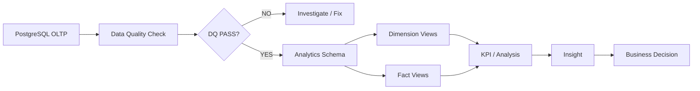

# AlloHub — Investment Ledger Analytics

> **투자·출자·배분 원장 데이터를 분석 가능한 Mart로 변환하고, 자금 정합성과 투자 집행 현황을 SQL로 검증하는 Data Analytics 프로젝트**

## 1. Project Overview

AlloHub는 출자자, 기업 투자, 투자금 배분, 회수·배분금 데이터를 관리하는 투자 원장 기반 프로젝트입니다.

Data Analytics 영역에서는 운영 데이터 자체를 변경하는 대신 PostgreSQL OLTP 원장을 분석 Source로 사용하여,

**Business Question → KPI 정의 → Data Quality 검증 → Analytics Mart → Insight**

흐름으로 데이터를 분석할 수 있는 구조를 만들었습니다.

```text
PostgreSQL OLTP
      ↓
Data Quality Check
      ↓
Analytics Mart
      ↓
KPI / Reconciliation
      ↓
Data Analysis
      ↓
Business Decision
```

### 핵심 구현

* SQL 기반 **Data Quality Rule 10개**
* 투자/배분 금액 정합성 검증
* `dim_*` / `fact_*` 기반 **Analytics Mart 6개**
* 운영 DB와 분석 계층 분리
* DQ 실패 시 분석 Mart를 신뢰하지 않는 **Quality Gate**
* Demo dataset 기반 투자 집행률 및 자금 잔액 검증

---

# 2. Business Problem

투자 원장에서는 단순히 투자 금액을 저장하는 것만으로는 충분하지 않습니다.

운영자는 다음 질문에 빠르게 답할 수 있어야 합니다.

* 현재 전체 출자금은 얼마인가?
* 그중 실제 기업 투자에 집행된 금액은 얼마인가?
* 아직 투자되지 않은 현금은 얼마인가?
* 각 투자 건의 출자자별 배분 합계가 실제 투자금과 일치하는가?
* 회수·배분된 금액과 출자자별 배분 상세 합계가 일치하는가?
* 특정 출자자에게 배분 비율이 과도하게 집중되어 있지는 않은가?
* 원장 데이터에 NULL, 중복, FK 단절 등의 문제가 없는가?

특히 금융성 데이터는 하나의 잘못된 행이 집계 결과 전체를 왜곡할 수 있습니다.

따라서 분석 전에 먼저 **원장 데이터가 분석 가능한 상태인지 검증하는 과정**이 필요하다고 판단했습니다.

---

# 3. Analysis Questions

## BQ-01. 전체 출자금 중 실제 투자에 얼마나 집행되었는가?

확인 지표:

* Total Contribution
* Total Investment
* Cash Balance
* Capital Deployment Rate

이를 통해 현재 자금이 얼마나 투자에 사용되었고 얼마나 현금으로 남아 있는지 확인합니다.

---

## BQ-02. 투자금 배분은 원장 금액과 일치하는가?

투자금은 출자자의 배분 비율에 따라 나누어집니다.

따라서 아래 조건이 항상 유지되어야 합니다.

```text
Investment Amount
=
SUM(Investor Allocated Amount)
```

차이가 발생하면 투자 원장 또는 배분 데이터에 정합성 문제가 있는 것으로 판단합니다.

---

## BQ-03. 회수·배분금은 출자자별 상세 금액과 일치하는가?

배분 데이터 역시 다음 조건을 만족해야 합니다.

```text
Distribution Amount
=
SUM(Distribution Detail Amount)
```

전체 배분금과 출자자별 상세 배분금의 차이를 확인하여 회수·정산 데이터 오류를 탐지합니다.

---

## BQ-04. 출자 비중은 특정 투자자에게 집중되어 있는가?

출자자별로 다음 데이터를 비교합니다.

```text
Contribution Amount
Allocation Ratio
Allocated Investment
Cumulative Distribution
```

이를 통해 전체 출자 구조와 투자자별 자금 비중을 확인할 수 있습니다.

---

# 4. KPI Definition

| KPI                             | 정의               | 계산                                           |
| ------------------------------- | ---------------- | -------------------------------------------- |
| Total Contribution              | 전체 출자금           | `SUM(investors.investment_amount)`           |
| Total Investment                | 전체 기업 투자금        | `SUM(investments.investment_amount)`         |
| Cash Balance                    | 아직 투자되지 않은 자금    | `Total Contribution - Total Investment`      |
| Capital Deployment Rate         | 출자금 중 실제 투자된 비율  | `Total Investment / Total Contribution`      |
| Allocation Reconciliation Gap   | 투자금과 출자자별 배분금 차이 | `Investment - SUM(Allocated)`                |
| Distribution Reconciliation Gap | 배분 원금과 상세 배분금 차이 | `Distribution - SUM(Distributed)`            |
| Investor Allocation Ratio       | 출자자별 자금 비중       | `Investor Contribution / Total Contribution` |
| Reconciliation Pass Rate        | 정합성 검증 통과 비율     | `PASS / Total Checks`                        |

---

# 5. Data Model

분석 Source는 운영 PostgreSQL 원장입니다.

## Source Tables

| Table                  | Grain     | 설명             |
| ---------------------- | --------- | -------------- |
| `investors`            | 출자자 1명    | 출자금, 배분 비율, 상태 |
| `investments`          | 기업 투자 1건  | 투자기업, 투자금, 투자일 |
| `investor_investments` | 투자 × 출자자  | 투자금의 출자자별 배분   |
| `distributions`        | 배분 1건     | 회수·배분금 원장      |
| `distribution_details` | 배분 × 출자자  | 출자자별 배분 상세     |
| `audit_logs`           | 변경 이벤트 1건 | 주요 데이터 변경 이력   |

핵심 관계는 다음과 같습니다.

```text
Investor
   │
   ├──────────────┐
   ↓              ↓
InvestorInvestment
   ↑
Investment
   │
   ↓
Distribution
   │
   ↓
DistributionDetail
   │
   └────────────→ Investor
```

---

# 6. Analytics Architecture

운영 Entity를 그대로 분석에 사용하지 않고 별도의 Analytics View를 제공합니다.



운영 데이터의 **Write Authority는 PostgreSQL OLTP에 유지**하고, Analytics 영역에서는 원장을 수정하지 않는 Read-only View를 사용합니다.

---

# 7. Data Quality

분석 결과보다 먼저 확인한 것은 데이터의 신뢰성이었습니다.

현재 SQL에서는 총 **10개의 Data Quality / Business Invariant Check**를 수행합니다.

| Check                                | 검증 목적                 |
| ------------------------------------ | --------------------- |
| `INVESTOR_PK_NULL`                   | 출자자 PK NULL 확인        |
| `INVESTOR_PK_DUPLICATE`              | 출자자 PK 중복 확인          |
| `INVESTMENT_AMOUNT_POSITIVE`         | 투자 금액 양수 검증           |
| `INVESTOR_INVESTMENT_FK_ORPHAN`      | 투자-출자자 관계 FK 검증       |
| `INVESTMENT_ALLOCATION_SUM_MISMATCH` | 투자금과 출자자별 배분 합계 비교    |
| `DISTRIBUTION_AMOUNT_POSITIVE`       | 배분 금액 양수 검증           |
| `DISTRIBUTION_DETAIL_FK_ORPHAN`      | 배분 상세 FK 검증           |
| `DISTRIBUTION_DETAIL_SUM_MISMATCH`   | 배분 원금과 상세 합계 비교       |
| `CASH_BALANCE_NEGATIVE`              | 투자금이 전체 출자금을 초과하는지 검증 |
| `ALLOCATION_RATIO_TOTAL_EXCEEDED`    | 전체 배분 비율 100% 초과 확인   |

결과는 다음 형태로 반환됩니다.

```text
check_name
failed_rows
status
checked_at
```

```text
failed_rows = 0
        ↓
      PASS

failed_rows > 0
        ↓
      FAIL
```

### Quality Gate

```text
OLTP Source
    ↓
DQ Check
    ↓
All PASS
    ↓
Analytics Mart Publish
```

DQ가 실패한 상태에서는 해당 Mart를 신뢰 가능한 분석 결과로 취급하지 않습니다.

---

# 8. Analytics Mart

분석을 위해 `analytics` schema 아래에 Dimension과 Fact View를 구성했습니다.

## Dimension

### `analytics.dim_investor`

출자자 분석 기준 정보입니다.

```text
investor_id
investor_name
contribution_amount
allocation_ratio
status
cumulative_distribution
created_at
updated_at
```

활용:

* 출자자별 투자 비중
* 출자자별 출자금
* 누적 배분금
* 출자자 상태 분석

---

### `analytics.dim_company`

투자기업 기준 Dimension입니다.

```text
company_key
company_name
investment_count
first_investment_at
latest_investment_at
```

활용:

* 기업별 투자 건수
* 최초 투자일
* 최근 투자일
* 기업 단위 투자 활동 분석

---

### `analytics.dim_date`

투자와 배분 이벤트를 날짜 기준으로 분석하기 위한 Dimension입니다.

```text
date_id
year
month
day
```

---

# 9. Fact Tables

## `analytics.fact_investment_allocation`

투자 한 건이 각 출자자에게 어떻게 배분되었는지를 분석합니다.

Grain:

```text
Investment × Investor
```

주요 컬럼:

```text
investment_id
company_name
business_date
investment_amount
investor_id
investor_name
allocation_ratio
allocated_amount
investment_status
```

이를 통해 다음 분석이 가능합니다.

* 기업별 투자 규모
* 투자별 출자자 구성
* 출자자별 투자 참여 금액
* 배분 비율과 실제 배분 금액 비교

---

## `analytics.fact_distribution_allocation`

회수·배분금이 각 출자자에게 어떻게 분배되었는지를 분석합니다.

Grain:

```text
Distribution × Investor
```

활용:

* 투자기업별 회수금
* 출자자별 배분금
* 배당/회수 유형별 분석
* 기간별 배분 현황

---

## `analytics.fact_reconciliation_check`

투자/배분 원장의 정합성을 분석 가능한 형태로 제공합니다.

검증 대상:

```text
Investment Allocation Sum
Distribution Detail Sum
Cash Balance
```

구조:

```text
expected_amount
actual_amount
status
checked_at
schema_version
```

단순 데이터 조회뿐 아니라 **Expected vs Actual 차이를 분석할 수 있도록 Fact 형태로 구성**했습니다.

---

# 10. Demo Analysis

> 아래 결과는 실제 운영 투자 데이터가 아니라 Repository의 Demo Seed를 이용한 재현 가능한 분석 예시입니다.

Demo 데이터는 3명의 출자자로 구성되어 있습니다.

| Investor  | Contribution | Allocation |
| --------- | -----------: | ---------: |
| 출자자 A     |        10억 원 |        20% |
| 출자자 B     |        15억 원 |        30% |
| 출자자 C     |        25억 원 |        50% |
| **Total** |    **50억 원** |   **100%** |

기업 X에는 총 **30억 원**을 투자합니다.

투자금은 배분 비율에 따라 다음과 같이 배분됩니다.

| Investor  | Allocated Investment |
| --------- | -------------------: |
| 출자자 A     |                 6억 원 |
| 출자자 B     |                 9억 원 |
| 출자자 C     |                15억 원 |
| **Total** |            **30억 원** |

---

# 11. Key Insights

## Insight 1 — 전체 출자금의 60%가 투자 집행됨

```text
Total Contribution = 50억
Total Investment   = 30억
Cash Balance       = 20억
```

따라서:

```text
Capital Deployment Rate
= 30억 / 50억
= 60%
```

현재 Demo 시점에서는 전체 출자금 중 **60%가 실제 기업 투자에 집행되고 40%는 현금으로 남아 있습니다.**

---

## Insight 2 — 최대 출자자 비중은 50%

출자자 C의 출자금은 25억 원으로 전체 50억 중 절반을 차지합니다.

```text
25억 / 50억 = 50%
```

따라서 출자 구조에서 가장 큰 단일 출자자의 비중은 **50%**입니다.

실제 운영 데이터가 확보되면 출자자 concentration과 자금 의존도를 별도 지표로 모니터링할 수 있습니다.

---

## Insight 3 — 투자 배분 Reconciliation Gap = 0

기업 X의 투자금:

```text
30억
```

출자자별 배분:

```text
6억 + 9억 + 15억 = 30억
```

따라서:

```text
Expected = 30억
Actual   = 30억
Gap      = 0
```

Demo 데이터에서는 투자 원장과 출자자별 배분 상세가 일치합니다.

---

# 12. Business Recommendations

### 1. 투자 집행률을 핵심 운영 KPI로 관리

단순 투자 건수보다

```text
Total Contribution
Total Investment
Cash Balance
Capital Deployment Rate
```

를 함께 모니터링하면 실제 자금 활용 상태를 더 명확하게 확인할 수 있습니다.

---

### 2. Reconciliation 실패를 우선 처리

투자금 또는 배분금의 상세 합계가 원장과 일치하지 않는 경우 다른 분석보다 먼저 원장 데이터를 확인해야 합니다.

따라서:

```text
DQ Failure
    ↓
Mart Publish 중단
    ↓
원장 검토
    ↓
재검증
    ↓
Analytics Publish
```

흐름을 유지합니다.

---

### 3. 출자자 Concentration 모니터링

출자자별 비중을 지속적으로 관찰해 특정 출자자 의존도가 높아지는지를 확인할 수 있습니다.

추후 실제 운영 데이터가 충분히 쌓이면 다음 지표로 확장할 수 있습니다.

* Top 1 Investor Share
* Top 3 Investor Share
* Investor Concentration
* 투자기업별 출자자 구성

---

# 13. Tech Stack

| Category           | Stack                  |
| ------------------ | ---------------------- |
| Database           | PostgreSQL             |
| Query / Analysis   | SQL                    |
| Data Modeling      | Dimension / Fact Mart  |
| Migration          | Flyway                 |
| Environment        | Docker, Docker Compose |
| Automation         | Bash                   |
| Source Application | Spring Boot            |

---

# 14. Repository Structure

```text
AlloHub_portfolio/
│
├── back/
│   └── db/
│       │
│       ├── analytics/
│       │   ├── 01_quality_checks.sql
│       │   ├── 02_analytics_marts.sql
│       │   └── README.md
│       │
│       ├── migration/
│       │   ├── V1__init.sql
│       │   └── V2__ledger_quality_constraints.sql
│       │
│       ├── seed/
│       │   ├── demo.sql
│       │   └── ops.sql
│       │
│       └── scripts/
│           ├── seed-demo.sh
│           └── seed-ops.sh
│
└── README.md
```

---

# 15. How to Run

## 1. Demo 데이터 적재

```bash
./back/db/scripts/seed-demo.sh
```

## 2. Data Quality 확인

```bash
psql "$DATABASE_URL" \
  -f back/db/analytics/01_quality_checks.sql
```

모든 항목이 다음 상태인지 확인합니다.

```text
status = PASS
```

## 3. Analytics Mart 생성

```bash
psql "$DATABASE_URL" \
  -f back/db/analytics/02_analytics_marts.sql
```

## 4. Mart 조회

예:

```sql
SELECT *
FROM analytics.fact_investment_allocation;
```

```sql
SELECT *
FROM analytics.fact_reconciliation_check;
```

---

# 16. What I Focused On

이 프로젝트에서 DA 영역은 단순히 SQL로 데이터를 조회하는 데 그치지 않고 다음 흐름을 구현하는 데 집중했습니다.

```text
Business Problem
      ↓
Business Question
      ↓
Metric Definition
      ↓
Data Quality
      ↓
Analytics Modeling
      ↓
SQL Analysis
      ↓
Insight
      ↓
Business Action
```

특히 금융성 데이터를 분석할 때는 **좋은 차트를 만드는 것보다 분석 대상 데이터가 신뢰 가능한지 먼저 검증하는 과정이 중요하다**고 판단했습니다.

운영 테이블을 직접 분석 결과물로 사용하지 않고 별도의 Analytics View를 구성하여 **운영 데이터와 분석 소비 계층의 책임을 분리**했습니다.

---

# 17. Current Status

| Area                                  | Status              |
| ------------------------------------- | ------------------- |
| PostgreSQL OLTP Schema                | Implemented         |
| Demo Dataset                          | Implemented         |
| Data Quality SQL                      | Implemented         |
| Analytics Mart                        | Implemented         |
| Investment Reconciliation             | Implemented         |
| Distribution Reconciliation Structure | Implemented         |
| KPI Definition                        | Defined             |
| Demo Analysis                         | Reproducible        |
| Production Dataset Analysis           | Not yet performed   |
| BI Dashboard                          | Not yet implemented |

실제 운영 데이터나 구현되지 않은 Dashboard 결과를 성과처럼 표현하지 않고, 현재 Repository에서 재현 가능한 범위를 기준으로 작성했습니다.

---

# 18. Next Steps

다음 단계에서는 현재 Mart를 기반으로 분석 범위를 확장할 예정입니다.

```text
Analytics Mart
      ↓
KPI Query
      ↓
Python / Pandas EDA
      ↓
Time-series / Investor Analysis
      ↓
Dashboard
      ↓
Business Recommendation
```

확장 후보:

* 월별 투자금 추이
* 투자기업별 누적 투자금
* 출자자별 Portfolio Allocation
* 투자 집행률 추이
* 회수·배분률 분석
* Reconciliation Failure Monitoring
* Investor Concentration 분석
* KVIC / KRX / OpenDART 외부 Reference 결합

---

## Summary

**AlloHub DA는 출자·투자·배분 데이터를 단순 조회하는 분석이 아니라, 원장 데이터의 정합성을 먼저 검증하고 이를 Dimension/Fact 기반 Analytics Mart로 변환하여 투자 집행률, 자금 잔액, 출자자 비중, 배분 정합성을 분석할 수 있도록 구성한 프로젝트입니다.**
