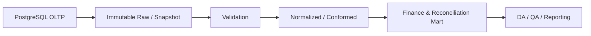

# AlloHub

## MVP 백엔드 설계 기준

> **프로젝트:** AlloHub / AllocHub · **분류:** BE · **상태:** PRD/SRS/SDD 기반 설계 통합본

현재 MVP의 핵심은 출자금, 기업 투자, 배분금의 **금액 정합성과 추적 가능성**이다. 확인되지 않은 성능이나 구현 결과는 사실로 쓰지 않는다.

### 1. 목적과 범위

상위 기준은 `PRD_v0 -> SRS_v0 -> SDD_v0`이다. MVP 백엔드는 출자자 등록, 기업 투자 등록과 자동 배분, 배분금 등록과 자동 계산, 정합성 조회, Audit Log를 일관된 transaction boundary에서 처리한다.

PRD의 핵심 불변식은 **총 출자금 = 기업 투자금 + 현금**, **배분 상세 합계 = 배분 원금**이다. 따라서 Controller, Service, Repository 분리는 단순 계층화가 아니라 계산, 검증, 저장을 한 트랜잭션으로 묶기 위한 책임 분리로 사용한다.

### 2. 도메인 경계

| 도메인 | 책임 |
| --- | --- |
| `Investor` | 출자자, 출자금, 배분비율 관리 |
| `Investment` | 기업 투자 원장 |
| `InvestorInvestment` | 투자 건별 출자자 배분 결과 |
| `Distribution` | 배당금/회수금 원장 |
| `DistributionDetail` | 출자자별 배분 상세 |
| `Reconciliation` | 자금 흐름 불변식 검증 |
| `AuditLog` | 주요 변경 이력 |

`Reconciliation`은 단순 조회 유틸이 아니라 투자/배분 write path의 검증 규칙으로 취급한다.

### 3. API 계약

SRS의 API를 상위 계약으로 사용한다.

| Method | Endpoint | 설명 |
| --- | --- | --- |
| `POST` | `/api/investors` | 출자자 등록 |
| `GET` | `/api/investors` | 출자자 목록 조회 |
| `PUT` | `/api/investors/{id}` | 출자자 수정 |
| `POST` | `/api/investments` | 투자 등록 + 출자자별 자동 배분 |
| `GET` | `/api/reconciliation` | 정합성 상태 조회 |
| `POST` | `/api/distributions` | 배분금 등록 |
| `POST` | `/api/distributions/calculate` | 배분액 계산 |
| `GET` | `/api/distributions` | 배분 이력 조회 |

OpenAPI 문서는 request/response schema, validation error, `401/403/409`, business-rule error를 구현과 동일하게 유지한다. 명세와 실제 endpoint 불일치를 release gate로 둔다.

### 4. Transaction 및 동시성

투자 등록 시 `Investment 생성 -> InvestorInvestment 계산/저장 -> 정합성 확인 -> AuditLog`가 하나의 atomic unit이어야 한다. 배분 등록도 `Distribution -> DistributionDetail -> 합계 검증 -> 원장 확정`을 같은 transaction으로 묶는다.

동시 요청으로 동일 원장을 이중 반영하지 않도록 business key/unique constraint와 transaction isolation을 함께 검토한다. 재시도 가능한 API라면 idempotency key 또는 중복 방지 키를 설계한다.

### 5. 금액 계산 원칙

금융성 금액은 부동소수 오차를 피하도록 DB의 exact numeric/decimal 또는 정수 최소단위를 사용한다. SRS의 "마지막 출자자 소수점 조정" 규칙은 계산 순서, 반올림 모드, 잔여액 처리 규칙을 코드와 테스트에 고정한다.

검증식은 다음을 기준으로 한다.

```text
sum(investor_investment.allocated_amount) = investment.amount
sum(distribution_detail.amount) = distribution.amount
total_contribution = total_investment + cash_balance
```

### 6. Validation / Exception

| 상황 | 응답 기준 |
| --- | --- |
| 필수값 누락, 금액 <= 0 | `400` |
| 중복 business key | `409` |
| 총 출자금 초과 투자 | business validation failure |
| 비율 합계 규칙 위반 | 요청 거절 |
| 인증 없음 | `401` |
| 권한 없음 | `403` |

예외 응답은 공통 error code, message, trace/correlation id를 갖게 하고 내부 stack trace를 외부에 노출하지 않는다.

### 7. Security / Audit

운용사와 관리자 권한을 구분하고 최소 권한을 적용한다. 투자와 배분 변경은 actor, action, entity, before/after 또는 변경 요약, timestamp를 AuditLog에 남긴다. 민감정보는 로그에 원문으로 과도하게 남기지 않는다.

### 8. Performance / Operations

SRS의 `조회 p95 1초`, `계산 500ms`, `가용성 99.5%`는 **검증 전 목표값**으로 취급한다. 부하테스트, APM, DB plan 증거가 없으면 달성했다고 표현하지 않는다.

주요 관측값은 request latency, error rate, DB latency, transaction rollback, reconciliation failure count, duplicate rejection count다.

### 9. 테스트 게이트

| 구분 | 검증 항목 |
| --- | --- |
| 단위 | 배분/투자 계산, 잔여액, 반올림 |
| 통합 | transaction rollback, repository constraint |
| API | 정상, 경계, 권한, 중복 |
| DB | FK, unique, check 및 정합성 SQL |
| 회귀 | 고정 dataset으로 총액 불변식 재실행 |

### 10. 공식문서

- Spring Boot Reference
- Spring Framework Transaction Management
- Spring Data JPA
- OpenAPI Specification
- PostgreSQL Numeric Types
- PostgreSQL Transaction Isolation
- OWASP ASVS

## 운영 원장 중심 Data Engineering 설계

> **프로젝트:** AlloHub / AllocHub · **분류:** DE · **상태:** 운영 원장 중심 Data Engineering 설계

MVP 원장은 정합성 보장이 우선이며, 분석용 pipeline은 운영 DB와 분리한다.

### 1. Data Engineering 목표

AllocHub의 DE 목표는 단순 ETL 구축이 아니라 **자금 원장의 재현성, 정합성, lineage를 유지하면서 분석/QA가 안전하게 소비할 수 있는 데이터 경로**를 만드는 것이다.

기본 흐름은 다음과 같다.



### 2. Source와 Grain

운영 source는 `Investor`, `Investment`, `InvestorInvestment`, `Distribution`, `DistributionDetail`, `AuditLog`다.

각 dataset은 grain을 명시한다.

| Dataset | Grain |
| --- | --- |
| `Investor` | 출자자 1행 |
| `Investment` | 기업 투자 건 1행 |
| `InvestorInvestment` | 투자 x 출자자 1행 |
| `Distribution` | 배분 원장 건 1행 |
| `DistributionDetail` | 배분 x 출자자 1행 |
| `AuditLog` | 변경 event 1행 |

모든 downstream table은 source id, business date/event time, extracted_at, schema_version을 보존한다.

### 3. Ingestion

MVP 규모에서는 batch snapshot 또는 증분 추출로 시작한다. 증분 기준은 `updated_at` 또는 안정적인 monotonic key를 사용하되 delete 처리 전략을 별도 정의한다.

재실행 시 동일 데이터가 중복 생성되지 않도록 pipeline task는 idempotent하게 설계한다. backfill은 처리 기간과 source snapshot을 고정하고 이미 확정된 결과를 조용히 덮어쓰지 않는다.

### 4. Raw / Staging / Curated

| Layer | 원칙 |
| --- | --- |
| Raw | source 형태를 최대한 보존하고 수집 시각, source PK, schema version 기록 |
| Staging | type 정규화, NULL/중복/참조 무결성 검사 |
| Curated | investor/investment/distribution 관계를 conformed key로 연결 |
| Mart | reconciliation, cash flow, distribution accuracy 등 분석 목적 집계 |

운영 원장을 mart로 대체하지 않는다. 운영 write authority는 PostgreSQL OLTP에 유지한다.

### 5. Data Quality Rules

핵심 DQ는 business invariant와 직접 연결한다.

- PK NULL/duplicate = 0
- FK orphan = 0
- 금액 < 0 금지
- 배분비율 허용범위 검증
- `sum(InvestorInvestment) = Investment.amount`
- `sum(DistributionDetail) = Distribution.amount`
- `total contribution = investment + cash` 불변식 검증
- source row count와 curated row count 차이는 명시한 filtering 규칙으로 설명 가능해야 함

실패 시 dataset을 quarantine하거나 pipeline을 fail하고 잘못된 mart를 publish하지 않는다.

### 6. Schema Change / Contract

Producer 변경은 column add/drop/type change를 분류하고 Consumer 호환성을 확인한다. schema version과 migration id를 metadata에 남긴다.

Breaking change는 staging validation과 downstream test 통과 후 반영하며, silently cast하여 오류를 숨기지 않는다.

### 7. Orchestration

Airflow를 사용하는 경우 DAG task는 deterministic input/output을 갖고 retry가 결과를 중복시키지 않아야 한다. source extraction, validation, transform, publish를 분리해 failure domain을 명확히 한다.

필수 운영 메타데이터는 다음과 같다.

- run_id
- logical/data interval
- source snapshot
- code/schema version
- row count
- DQ status
- retry count
- started/finished time

### 8. Serving

DA/QA에는 운영 Entity를 그대로 노출하기보다 분석 grain이 명확한 mart를 제공한다.

- `fact_investment_allocation`
- `fact_distribution_allocation`
- `fact_reconciliation_check`
- `dim_investor`
- `dim_company`
- `dim_date`

mart 계산식은 DA metric definition과 동일한 source of truth를 사용한다.

### 9. Monitoring

pipeline success rate, freshness, row-count anomaly, DQ failure, reconciliation mismatch, late data, schema drift를 감시한다. 장애 원인은 run_id로 raw -> curated -> mart까지 추적 가능해야 한다.

### 10. 공식문서

- AWS Data Architecture
- AWS Data Engineering
- Apache Airflow Best Practices
- dbt Data Tests
- PostgreSQL Constraints
- PostgreSQL Indexes

### External Reference Data Pipeline

#### Source

- KVIC 모태펀드 자조합 운용사: 연간 snapshot 성격의 Fund/GP reference
- 금융위원회 KRX 상장종목정보: Company master, 일 단위 갱신 기준
- OpenDART: 기업개황, 공시, 재무/주요사항 reference

#### Pipeline

```text
extract -> raw snapshot -> schema validation -> normalize -> identity matching -> reference tables -> serving
```

- raw는 원본 보존 및 재처리를 위해 immutable snapshot으로 관리한다.
- `source + source_key + reference_date` 기준 idempotent 적재를 적용한다.
- KRX와 DART 기업 식별자는 법인등록번호, 종목코드 등 사용 가능한 key를 우선하며 불일치는 DQ 대상으로 격리한다.
- 공시 데이터는 append 중심으로 관리하고 중복 report_no를 방지한다.
- 수집 실패 시 내부 ledger는 정상 동작하며 외부 reference의 freshness 상태만 degraded 처리한다.

#### Data Quality

- company master duplicate rate
- KRX/DART match rate
- null identifier rate
- stale reference count
- corporate event duplicate rate
- source row count / normalized row count reconciliation

#### 공식 데이터

- https://www.data.go.kr/data/3060708/fileData.do?recommendDataYn=Y
- https://www.data.go.kr/data/15094775/openapi.do
- https://opendart.fss.or.kr/intro/main.do

## ML - Investment Anomaly Detection Feasibility Specification

> **상태:** CONDITIONAL / PROPOSED / NOT IMPLEMENTED / NOT TESTED

> **적용 경계:** AlloHub의 현재 핵심은 출자, 투자, 배분 원장의 정합성과 감사 가능성이다. ML은 기존 정합성 규칙을 대체하지 않고, 충분한 운영 데이터가 축적된 뒤 사람이 검토할 이상 후보의 우선순위를 보조하는 경우에만 검토한다.

### 1. Document Overview

- 관련 기준 문서: PRD_v0, SRS_v0, SDD_v0, DE - Data Engineering Specification, DA - Data Analytics Specification, QA - QA/QC Specification
- 현재 운영 source: `Investor`, `Investment`, `InvestorInvestment`, `Distribution`, `DistributionDetail`, `AuditLog`
- 외부 enrichment 후보: KVIC, KRX, OpenDART
- 현재 ML 모델 구현 증거: 없음

### 2. Problem Definition

#### 2.1 Non-ML Goal

투자/배분 데이터의 불일치나 비정상 패턴을 빠르게 찾아 운영자가 검토할 수 있게 한다.

#### 2.2 Why ML Is Conditional

현재 AlloHub에는 이미 다음과 같은 결정적 정합성 규칙이 존재한다.

- 투자금 배분 합계 = `Investment.amount`
- 배분 상세 합계 = `Distribution.amount`
- `AuditLog`로 변경 이력 추적

이런 규칙으로 확정 가능한 오류는 ML보다 rule-based validation이 우선이다. ML은 규칙으로 명확히 정의하기 어려운 패턴이 충분히 축적되고, 모델이 기존 rule baseline보다 실질적인 검토 효율을 개선할 때만 적용한다.

### 3. Intended ML Use Case

후보 task는 **anomaly ranking / review prioritization**이다.

모델이 할 수 있는 일은 다음과 같다.

- 거래/배분 패턴 중 과거와 다른 후보 점수화
- 반복 수정 또는 비정상적인 `AuditLog` 패턴 탐색
- 검토 대상 우선순위 제안

모델이 하면 안 되는 일은 다음과 같다.

- `Investment`/`Distribution` 금액 자동 수정
- 원장 정합성 규칙 무시
- 투자 적합성 또는 수익성 자동 판정
- 사람 승인 없이 업무 상태 변경

### 4. Data Feasibility Gate

ML 실험은 다음 조건을 만족한 뒤 시작한다.

1. 충분한 기간의 `Investment` / `Distribution` / `AuditLog` 이력 확보
2. 정상/오류/수정 사례를 구분할 수 있는 검토 결과 또는 proxy label 확보
3. 학습 시점과 추론 시점에 동일하게 사용할 수 있는 feature 확인
4. 데이터 누락, 중복, 시간 기준 정합성 검증 완료

조건을 충족하지 못하면 **NO-ML**을 유지한다.

### 5. Baseline

Rule baseline은 다음을 기준으로 한다.

- allocation sum mismatch
- distribution detail sum mismatch
- 비정상 상태 전이
- `AuditLog` 변경 횟수/빈도 threshold
- reconciliation 결과

ML 후보는 반드시 이 baseline보다 추가적인 검토 가치가 있는지 비교한다.

### 6. Candidate Features

데이터가 충분할 때만 다음을 검토한다.

- investment amount / distribution amount
- investor별 allocation 비율
- distribution ratio
- transaction 간 시간 간격
- `AuditLog` 변경 빈도
- 동일 레코드 반복 수정 횟수
- reconciliation 결과
- company master match 여부

미래 정보나 사후 검토 결과가 학습 feature에 섞이지 않도록 leakage를 점검한다.

### 7. Candidate Models

첫 실험은 복잡한 DL이 아니라 단순한 모델부터 시작한다.

- heuristic / statistical threshold
- Isolation Forest 등 unsupervised baseline
- label 확보 시 Logistic Regression / Tree-based classifier 후보

현재 단계에서 특정 알고리즘을 최종 모델로 확정하지 않는다.

### 8. Evaluation

모델 metric과 업무 success metric을 분리한다.

#### Model Evaluation Candidate

- Precision / Recall / F1: label이 있는 분류 문제로 전환 가능한 경우
- Precision@K: 상위 검토 후보 품질
- false-positive rate

#### Business Success Candidate

- 검토자가 확인해야 하는 건수 감소
- 실제 오류 후보 발견율 개선
- 평균 검토 시간 감소

구체적인 acceptance threshold는 실제 dataset과 baseline 측정 전까지 **TBD**다.

### 9. Serving & Human Decision Boundary

권장 구조는 다음과 같다.

```text
Operational DB -> validated feature dataset -> anomaly scoring -> review queue -> human review
```

ML 결과는 Evidence/Signal이며 최종 원장 데이터가 아니다. 모델 실패 시 기존 rule-based reconciliation과 수동 검토 흐름으로 fallback한다.

### 10. Monitoring

실제 도입 시 다음을 추적한다.

- input data quality
- feature distribution 변화
- anomaly score distribution
- false-positive / false-negative feedback
- inference failure
- model version

### 11. Decision Gate

다음 중 하나라도 충족하지 못하면 ML을 production 범위에 넣지 않는다.

- 충분하고 신뢰 가능한 데이터
- prediction-time feature availability
- rule baseline 대비 유의미한 개선
- 운영자가 결과에 따라 취할 수 있는 명확한 action
- 유지/모니터링 비용을 정당화할 업무 효과

### 12. Evidence & Status

| 항목 | 상태 |
| --- | --- |
| Rule-based reconciliation | 기존 설계에 존재 |
| ML use case | PROPOSED |
| Training dataset | NOT VERIFIED |
| Label / ground truth | NOT VERIFIED |
| Model training | NOT IMPLEMENTED |
| Evaluation | NOT TESTED |
| Serving | NOT IMPLEMENTED |
| Monitoring | DESIGNED ONLY |

### 13. Official References

- Google for Developers - Introduction to Machine Learning Problem Framing: https://developers.google.com/machine-learning/problem-framing
- Google for Developers - Understand the problem: https://developers.google.com/machine-learning/problem-framing/problem
- Google for Developers - Framing an ML problem: https://developers.google.com/machine-learning/problem-framing/ml-framing
- Google for Developers - Implementing a model: https://developers.google.com/machine-learning/problem-framing/implement-model

> **결론:** AlloHub의 ML은 필수 기능이 아니다. 현재는 rule-based reconciliation이 기준이며, 운영 데이터가 충분히 축적되고 ML이 baseline보다 실제 검토 효율을 높인다는 증거가 생길 때만 anomaly detection/ranking을 확장한다.

## AI - Investment Information & Evidence Assistant Specification

> **상태:** DESIGNED / PROPOSED / PARTIALLY IMPLEMENTED / NOT TESTED IN PRODUCTION

> **핵심 경계:** AI는 AlloHub의 투자/배분 원장 계산기나 최종 투자 판단자가 아니다. 내부 원장과 검증된 외부 정보를 사람이 확인하기 쉽게 설명하고 Evidence를 정리하는 보조 계층이다.

### 1. Document Overview

- 관련 기준 문서: PRD_v0, SRS_v0, SDD_v0, DE - Data Engineering Specification, DA - Data Analytics Specification
- 내부 source: `Investor`, `Investment`, `InvestorInvestment`, `Distribution`, `DistributionDetail`, `AuditLog`
- 외부 source 후보: OpenDART 기업/공시 정보, KVIC 통계/공시, KRX reference data
- 생성형 AI provider 연동 증거: 없음
- 현재 구현 범위: 내부 원장 evidence 조회 및 deterministic summary API

### 2. AI Problem Definition

#### Goal

운영자가 투자기업, 출자, 배분 현황과 관련 공시/기업정보를 여러 화면과 source에서 직접 대조하는 부담을 줄인다.

#### Intended Use

- 특정 투자기업의 내부 투자 현황 설명
- 관련 공시/기업정보 요약
- 내부 데이터와 외부 reference를 함께 보여주는 Evidence 정리
- `AuditLog` 기반 변경 내역 설명 보조

#### Out of Scope

- 투자 여부 추천 또는 자동 의사결정
- 예상 수익률 생성
- 원장 금액 계산 또는 수정
- `Distribution` 자동 승인
- 외부 정보만으로 내부 원장 값을 덮어쓰기

### 3. Functional Requirements

- **AI-FR-01** 사용자가 선택한 투자기업과 관련된 내부 투자/배분 context를 조회할 수 있어야 한다.
- **AI-FR-02** 외부 정보가 사용되는 경우 source와 기준 시점을 함께 제시해야 한다.
- **AI-FR-03** 공시나 기업정보는 원문의 핵심 사실을 압축하되 내부 원장 사실과 구분해야 한다.
- **AI-FR-04** 근거를 찾지 못한 내용은 확정 사실처럼 생성하지 않아야 한다.
- **AI-FR-05** AI 응답으로 `Investment`/`Distribution`/`AuditLog`를 자동 변경하지 않아야 한다.
- **AI-FR-06** 중요한 금융/운영 판단은 사용자 확인을 거쳐야 한다.

### 4. Knowledge & Data Boundary

Trusted internal context는 `Investor`, `Investment`, `InvestorInvestment`, `Distribution`, `DistributionDetail`, `AuditLog`다.

External evidence candidate는 다음과 같다.

- OpenDART: 기업/공시 원문/메타데이터
- KVIC: 벤처투자 관련 공식 통계/공시
- KRX: 상장회사/시장 reference

외부 source는 내부 원장의 authoritative source가 아니라 enrichment/evidence다.

### 5. AI System Design

권장 구조는 다음과 같다.

```text
User Query -> authorization check -> internal context retrieval + external evidence retrieval -> grounded generation -> source/evidence display -> human review
```

AI layer는 기존 BE transaction 및 reconciliation 경로와 분리한다.

현재 구현 API는 다음과 같다.

```http
POST /api/ai/investment-evidence
Authorization: Bearer <operator-or-admin-token>
Content-Type: application/json

{
  "investmentId": "optional-investment-id",
  "companyName": "optional-company-name"
}
```

`investmentId` 또는 `companyName` 중 하나가 필요하다. 응답은 내부 원장 facts, 외부 evidence 미구현 상태, source 기준시점, human decision boundary를 포함한다.

### 6. Retrieval & Grounding

- 회사 식별자는 가능한 경우 내부 company mapping과 외부 식별자를 명시적으로 연결한다.
- retrieval 결과에는 source, 기준일, 식별자를 유지한다.
- 답변은 retrieval된 context 범위에서 작성한다.
- 내부 원장 값과 외부 공시 값이 다르면 하나를 임의 선택하지 않고 차이를 표시한다.
- 현재 구현은 외부 retrieval/provider가 없으므로 내부 원장 기반 deterministic summary만 생성한다.

### 7. Output Contract

AI 응답은 최소 다음 구조를 권장한다.

1. 요약
2. 내부 원장 기준 사실
3. 외부 Evidence
4. 차이/주의사항
5. Source / 기준 시점

수치가 포함된 경우 가능한 한 원장/공시 source를 함께 표시한다.

### 8. Evaluation

구현 후 다음을 평가한다.

- groundedness / source support
- 내부 원장 숫자 보존 정확성
- source citation 정확성
- unsupported claim 비율
- retrieval miss
- 사용자 검토 완료율
- latency / failure rate

현재 실제 evaluation dataset과 threshold는 **NOT DEFINED / NOT TESTED**다.

### 9. Responsible AI & Risk Controls

NIST AI RMF 및 Generative AI Profile의 위험관리 관점을 적용한다.

- **GOVERN:** AI owner, source owner, 승인/변경 책임 정의
- **MAP:** intended use와 금지 use case 문서화
- **MEASURE:** unsupported claim, grounding, source freshness, 오류 측정
- **MANAGE:** fallback, human review, incident 기록, source 차단/교체 절차

특히 금융 데이터 설명에서 생성된 문장을 authoritative ledger record로 취급하지 않는다.

### 10. Security & Privacy

- 기존 AlloHub 권한 범위를 retrieval에도 적용한다.
- 사용자가 볼 수 없는 투자/출자 데이터가 prompt/context에 포함되지 않도록 한다.
- 민감 내부 데이터의 외부 모델 전송 여부는 실제 provider/배포 구조 결정 후 별도 검토한다.
- prompt와 response logging은 개인정보/민감정보 보존 정책과 함께 설계한다.

### 11. Failure & Fallback

- retrieval 실패: 답변 생성 대신 근거 부족 표시
- 외부 source 장애: 내부 원장 기준 정보만 표시하고 외부 정보 미확인 상태 명시
- 모델 timeout/error: 기존 AlloHub 조회 화면으로 fallback
- 내부/외부 수치 충돌: 사용자 검토 대상으로 표시

### 12. Evidence & Status

| 항목 | 상태 |
| --- | --- |
| Internal ledger sources | 기존 설계에 존재 |
| External data source design | DE 문서에 설계 |
| AI assistant use case | PROPOSED |
| Internal retrieval implementation | IMPLEMENTED |
| External retrieval implementation | NOT IMPLEMENTED |
| Prompt / generation implementation | DETERMINISTIC SUMMARY ONLY |
| Evaluation dataset | NOT DEFINED |
| Production monitoring | NOT IMPLEMENTED |

### 13. Official References

- NIST - AI Risk Management Framework 1.0: https://www.nist.gov/publications/artificial-intelligence-risk-management-framework-ai-rmf-10
- NIST - Artificial Intelligence Risk Management Framework: Generative Artificial Intelligence Profile: https://www.nist.gov/publications/artificial-intelligence-risk-management-framework-generative-artificial-intelligence
- Google for Developers - Introduction to Machine Learning Problem Framing: https://developers.google.com/machine-learning/problem-framing

> **결론:** AlloHub의 AI는 투자 원장을 변경하거나 투자 결정을 대신하는 기능이 아니라, 검증된 내부/외부 Evidence를 검색, 요약, 설명해 운영자의 확인 비용을 낮추는 보조 기능으로 한정한다. 현재 구현은 내부 원장 evidence 조회와 deterministic summary까지다.

## QA/QC - PRD/SRS/SDD 추적 기반 품질 통합본

> **프로젝트:** AlloHub / AllocHub · **분류:** QA/QC · **상태:** PRD/SRS/SDD 추적 기반 품질 통합본

품질의 최우선 기준은 UI 정상 동작보다 **금액 불변식, transaction atomicity, 추적성**이다.

### 1. Quality Objective

PRD/SRS의 요구사항을 검증 가능한 acceptance criteria로 연결한다.

- 출자비율/금액 validation
- 투자 자동배분 정확성
- 배분금 자동계산 정확성
- 총 출자금 정합성
- transaction rollback
- 인증/인가
- `AuditLog` 추적
- API NFR

### 2. Traceability

RTM은 최소 `PRD Goal/FR -> SRS FR/BR/NFR -> SDD Component/API/Entity -> Test Case -> Result/Evidence`를 연결한다.

예시는 다음과 같다.

- `G-001 -> BR-005 -> ReconciliationService -> TC-REC-*`
- `FR-007/008 -> DistributionService -> TC-DIST-*`

### 3. Static Review

구현 전/PR review 단계에서 다음을 확인한다.

- 계산식이 문서와 동일한가
- 반올림/잔여액 정책이 명시되어 있는가
- transaction 경계가 중간 상태를 외부에 노출하지 않는가
- amount에 부동소수형을 잘못 쓰지 않는가
- OpenAPI와 Controller 계약이 일치하는가
- authorization check가 write API에 적용되는가

### 4. Functional Test

#### Investor

- 정상 등록
- 금액 0/음수
- 비율 경계값
- 합계 초과
- 중복

#### Investment

- 정상 투자 및 자동 배분
- 총 출자금 초과
- 모든 상세 합계 검증
- 중간 insert 실패 시 전체 rollback

#### Distribution

- 배당/회수 유형
- 소수점/잔여액 edge case
- 상세 합계 = 원금
- 중복 요청/재시도

### 5. Database Test

- PK/FK/UNIQUE/CHECK 제약
- orphan 0
- 투자/배분 원장과 detail 합계
- migration 전후 row count/business invariant
- 필요한 query의 EXPLAIN plan

### 6. API / Security Test

- schema validation 400
- authentication 401
- authorization 403
- duplicate 409
- 없는 resource 404
- 내부 오류 5xx의 정보노출 여부

OWASP WSTG 관점에서 authentication, authorization, input validation, session, error handling을 점검한다.

### 7. Non-functional Test

SRS의 `조회 p95 1초`, `계산 500ms`, `99.5% availability`는 실제 측정 계획을 별도로 둔다.

- 동일 dataset/환경/동시성 기록
- warm-up 후 반복 측정
- p50/p95와 error rate 함께 기록
- DB slow query와 application latency 분리

증거가 없으면 `NOT TESTED`다.

### 8. Regression

고정 fixture를 사용해 다음 불변식을 매 배포마다 재검증한다.

- total contribution = investment + cash
- sum investment allocation = investment amount
- sum distribution details = distribution amount
- rollback 후 partial row = 0

### 9. Defect Management

결함에는 requirement id, test case, severity, environment, reproduction, evidence, root cause, fix version, retest/regression result를 남긴다.

금액 불일치, 권한 우회, partial commit은 release-blocking defect로 취급한다.

### 10. Release Gate

- P0/P1 계산/정합성 defect 0
- RTM 핵심 요구사항 coverage 완료
- 고정 regression pass
- security critical/high 미해결 0
- migration/reconciliation evidence 확보
- 성능 NFR은 측정 결과 또는 명확한 `NOT TESTED` 표시

### 11. 공식문서

- ISTQB Certified Tester Foundation Level
- OWASP Web Security Testing Guide
- OWASP ASVS
- PostgreSQL Constraints
- Spring Boot Testing

---

## 1. 핵심 한 줄

> **AlloHub는 투자/분배 목록 조회에서 DB를 여러 번 왕복하던 N+1 구조를 fetch join으로 줄이고, 감사 로그 최신순 조회에 맞춘 인덱스를 추가해 조회 경로를 최적화한 프로젝트입니다.**

---

## 2. 효율화 배경

AlloHub는 JPA/Hibernate 기반 백엔드입니다. JPA는 객체 중심으로 데이터를 다룰 수 있게 해주지만, 연관 엔티티를 언제 가져오는지 잘못 설계하면 목록 조회에서 DB를 반복 호출하는 문제가 생길 수 있습니다.

Hibernate 공식문서에서도 데이터를 언제, 어떻게 가져오는지(fetching)를 조정하는 것은 애플리케이션 성능에 큰 영향을 주는 요소라고 설명합니다. 특히 `SELECT` fetching은 별도 SQL select로 연관 데이터를 가져오는 방식이며, 일반적으로 N+1 select라고 불리는 전략이라고 설명합니다. 반대로 `JOIN` fetching은 SQL outer join을 사용해 연관 데이터를 함께 가져오는 방식입니다.

비전공자 관점에서 보면, 기존 구조는 이런 상황에 가깝습니다.

```text id="b72i0v"
투자 목록을 가져온다.
→ 1번 투자자의 정보를 다시 찾는다.
→ 2번 투자자의 정보를 다시 찾는다.
→ 3번 투자자의 정보를 다시 찾는다.
→ ...
→ 투자 건수가 늘어날수록 DB 조회도 계속 늘어난다.
```

즉, 목록을 한 번 가져온 뒤 각 항목의 관련 정보를 다시 물어보는 구조였습니다.

---

## 3. 코드 효율화: N+1 쿼리 제거

## 3-1. 기존 문제

`InvestmentService.list()`와 `DistributionService.list()`는 목록 데이터를 가져올 때 먼저 `findAll()`로 기본 목록을 조회한 뒤, 각 항목마다 연결된 투자자나 투자 정보를 다시 꺼내는 구조였습니다.

```text id="asb0rr"
Before

1. findAll()로 기본 목록 조회
2. 각 Investment마다 InvestorInvestment 조회
3. 각 InvestorInvestment마다 Investor 조회
4. 각 Distribution마다 Investment 조회
5. 데이터가 늘수록 추가 SQL 증가
```

이런 문제를 보통 **N+1 쿼리 문제**라고 부릅니다. 처음 목록 조회 1번에, 목록 개수 N개만큼 추가 조회가 붙을 수 있는 구조입니다.

비전공자식으로 말하면,
장부 전체를 한 번에 가져오지 않고 **“목록 한 장 받고 → 관련 정보 한 명씩 다시 물어보는 구조”**입니다.

---

## 3-2. 개선 방법

목록 화면에서 실제로 필요한 연관 데이터를 Repository 단계에서 미리 같이 가져오도록 변경했습니다.

| 변경 파일                         | 개선 내용                                                                     |
| ----------------------------- | ------------------------------------------------------------------------- |
| `InvestmentRepository.java`   | 투자 목록을 가져올 때 `investorInvestments`, `investor`까지 `LEFT JOIN FETCH`로 함께 조회 |
| `InvestmentService.java`      | 기존 `findAll()` 대신 `findAllWithInvestorInvestments()` 사용                   |
| `DistributionRepository.java` | 분배 목록을 가져올 때 연결된 `investment`까지 `LEFT JOIN FETCH`로 함께 조회                  |
| `DistributionService.java`    | 기존 `findAll()` 대신 `findAllWithInvestment()` 사용                            |

개선 후 흐름은 아래와 같습니다.

```text id="l3uhp2"
After

1. 투자 목록 + 투자자 정보를 한 번에 조회
2. 분배 목록 + 투자 정보를 한 번에 조회
3. Service에서는 이미 가져온 데이터를 조립
4. 항목마다 DB를 다시 조회하지 않음
```

비전공자식으로 말하면,
기존에는 손님 명단을 받은 뒤 한 명씩 주소를 다시 물어봤다면, 개선 후에는 **처음부터 이름·주소가 같이 적힌 명단을 받는 방식**입니다.

---

## 3-3. 왜 효율화인가?

기존 구조는 데이터가 5건일 때는 크게 티가 나지 않아도, 100건, 1,000건으로 늘어나면 DB에 계속 추가 요청을 보내는 구조입니다.

```text id="l2r7if"
기존 구조:
목록 1번 조회
+ 각 행마다 추가 조회
→ 데이터가 늘수록 DB 왕복 증가

개선 구조:
목록과 필요한 연관 데이터를 함께 조회
→ DB 왕복 횟수 감소
→ 목록 조회 안정성 증가
```

그래서 이 작업은 단순히 Repository 메서드 이름을 바꾼 것이 아니라, **DB 접근 횟수를 줄인 조회 성능 개선**입니다.

---

## 4. 성능 회귀 테스트 추가

성능 개선은 “고쳤다”에서 끝내면 나중에 같은 문제가 다시 생길 수 있습니다.
그래서 Hibernate `Statistics`를 사용해 `list()` 실행 시 실제 SQL이 몇 번 실행되는지 테스트했습니다.

Hibernate `Statistics` 공식 Javadoc은 `hibernate.generate_statistics=true`로 통계 수집을 켤 수 있고, `Statistics`가 SessionFactory에 속한 모든 세션의 통계를 노출한다고 설명합니다.

| 테스트 파일                              | 검증 내용                                  |
| ----------------------------------- | -------------------------------------- |
| `InvestmentServiceQueryCountTest`   | 투자 목록 조회 시 SQL 실행 횟수가 과도하게 늘어나지 않는지 확인 |
| `DistributionServiceQueryCountTest` | 분배 목록 조회 시 SQL 실행 횟수가 과도하게 늘어나지 않는지 확인 |

검증 방식은 다음과 같습니다.

```text id="0c0pmm"
투자/분배 데이터 5건 생성
→ list() 실행
→ SQL 실행 횟수가 2개 이하인지 확인
```

기존 `findAll()` 방식으로 되돌리면 데이터 건수만큼 추가 쿼리가 발생해 테스트가 실패합니다. 즉, 나중에 누군가 실수로 다시 N+1 구조를 만들면 테스트 단계에서 바로 잡을 수 있습니다.

비전공자식으로 말하면,
단순히 “문제를 고쳤다”가 아니라 **같은 문제가 다시 생기면 자동으로 알람이 울리는 검사표를 추가한 것**입니다.

---

## 5. DB 효율화: 감사 로그 최신순 인덱스 추가

## 5-1. 기존 문제

`AuditLogRepository.findTop100ByOrderByCreatedAtDesc()`는 감사 로그를 최신순으로 100개만 가져오는 조회입니다.

```text id="qotliy"
감사 로그 전체 중에서
가장 최근에 쌓인 100개만 보여줘.
```

그런데 `created_at` 기준 인덱스가 없으면 로그가 많아질수록 DB가 전체 로그를 훑고, 다시 최신순으로 정렬한 뒤, 상위 100개를 잘라야 할 수 있습니다.

```text id="6s4k8a"
Before

전체 로그 읽기
→ created_at 기준으로 정렬
→ 상위 100개 선택
```

비전공자식으로 말하면,
가장 최근 기록 100개를 찾기 위해 **전체 일지를 처음부터 끝까지 뒤진 뒤 다시 날짜순으로 정렬하는 방식**입니다.

---

## 5-2. 개선 방법

`audit_logs.created_at` 기준으로 내림차순 인덱스를 추가했습니다.

```java id="yt8v7b"
@Table(
    name = "audit_logs",
    indexes = @Index(
        name = "idx_audit_logs_created_at",
        columnList = "created_at DESC"
    )
)
public class AuditLog {
}
```

운영 DB에 직접 반영해야 하는 SQL은 다음과 같습니다.

```sql id="kkvmv1"
CREATE INDEX idx_audit_logs_created_at
ON audit_logs (created_at DESC);
```

PostgreSQL 공식문서는 `ORDER BY`와 `LIMIT n`이 함께 있는 경우, 정렬 조건에 맞는 인덱스가 있으면 인덱스 순서대로 앞의 n개 행을 바로 가져올 수 있다고 설명합니다. 또한 B-tree 인덱스는 `ASC`, `DESC`, `NULLS FIRST`, `NULLS LAST` 같은 정렬 옵션을 지정해 만들 수 있습니다.

즉, 이번 인덱스는 단순히 “인덱스를 하나 더 만든 것”이 아니라, **최신 감사 로그 100개 조회 패턴에 맞춰 책갈피를 꽂은 작업**입니다.

---

## 5-3. 인덱스 추가 효과

변경 전후를 비교하면 아래와 같습니다.

```text id="jb5xro"
Before

audit_logs 전체 확인
→ created_at 기준 정렬
→ 최신 100개 선택

After

created_at DESC 인덱스 활용
→ 최신순으로 정리된 길을 따라감
→ 필요한 100개만 선택
```

| 항목           | 개선 효과                        |
| ------------ | ---------------------------- |
| 최신 로그 조회     | 전체 정렬 부담 감소                  |
| 로그 데이터 증가 대응 | 로그가 쌓여도 조회 경로 안정화            |
| 관리자/감사 화면    | 최신 100건 확인 속도 개선             |
| DB 부하        | 불필요한 Full Scan + Sort 가능성 감소 |

비전공자식으로 말하면,
전체 일지를 매번 뒤지는 것이 아니라 **이미 최신순으로 정리된 색인표에서 앞 100개만 보는 방식**입니다.

---

## 6. 운영 반영 시 주의점

AlloHub는 Flyway 같은 마이그레이션 도구 없이 `ddl-auto`로 스키마를 관리하고 있습니다. 따라서 환경별 동작을 구분해야 합니다.

| 환경    | `ddl-auto`    | 의미                        |
| ----- | ------------- | ------------------------- |
| local | `update`      | Entity 변경을 DB에 반영 가능      |
| test  | `create-drop` | 테스트마다 스키마 생성 후 삭제         |
| prod  | `validate`    | 스키마가 맞는지만 확인하고 직접 변경하지 않음 |

Spring Boot 공식문서는 `spring.jpa.hibernate.ddl-auto` 값을 명시할 수 있고, 표준 Hibernate 값으로 `none`, `validate`, `update`, `create`, `create-drop` 등을 사용할 수 있다고 설명합니다. 또한 embedded DB일 때는 기본값이 `create-drop`, 그 외에는 `none`이 될 수 있다고 안내합니다.

따라서 로컬과 테스트 환경에서는 인덱스가 자동으로 반영될 수 있지만, 운영 환경이 `validate`라면 운영 DB에는 자동 생성되지 않습니다.

운영 반영이 필요하면 PostgreSQL에 아래 SQL을 별도로 실행해야 합니다.

```sql id="b8hkr0"
CREATE INDEX idx_audit_logs_created_at
ON audit_logs (created_at DESC);
```

---

## 7. 이미 잘 되어 있던 부분

이번에 새로 고치지 않아도 되는 부분도 있었습니다.

| 항목                                        | 의미                                 |
| ----------------------------------------- | ---------------------------------- |
| 생성자 기반 DI                                 | 객체 의존성을 명확하게 주입하는 구조               |
| `GlobalExceptionHandler` / `AppException` | 예외 처리 방식 일원화                       |
| `@Transactional(readOnly = true)`         | 조회 전용 트랜잭션 구분                      |
| `spring.jpa.open-in-view: false`          | 화면 응답 단계에서 무분별한 지연 로딩이 발생하지 않도록 제한 |

즉, AlloHub 백엔드는 기본적인 계층 구조와 예외 처리, 조회 트랜잭션 구분은 이미 잡혀 있었고, 이번 작업은 그중 **목록 조회 성능 병목 가능성이 있는 부분을 보완한 것**입니다.

---

## 8. 최종적으로 줄어든 비용

이번 코드·DB 효율화로 줄어든 비용은 아래와 같습니다.

```text id="5gvzry"
1. 목록 조회 시 DB 왕복 횟수 감소
2. 투자/분배 데이터 증가에 따른 추가 쿼리 위험 감소
3. N+1 문제가 재발했을 때 테스트 단계에서 감지 가능
4. 최신 감사 로그 조회 시 정렬 부담 감소
5. 운영 DB 반영 방식 명확화
6. 조회 성능 개선 근거를 공식문서와 테스트로 설명 가능
```

---

## 9. 문서용 요약 문장

AlloHub 코드·DB 효율화는 JPA/Hibernate 기반 조회 구조에서 발생할 수 있는 N+1 쿼리 문제와 최신 감사 로그 조회용 인덱스 부재를 개선한 작업입니다.

기존에는 `InvestmentService.list()`와 `DistributionService.list()`가 `findAll()`로 기본 목록을 조회한 뒤, 각 항목의 연관 엔티티를 지연 로딩하면서 데이터 건수만큼 추가 쿼리가 발생할 수 있었습니다. 이를 Repository 단계에서 `LEFT JOIN FETCH`로 필요한 연관 데이터를 한 번에 가져오도록 변경했습니다.

또한 Hibernate `Statistics` 기반 회귀 테스트를 추가해, 향후 동일한 N+1 문제가 다시 생기면 테스트 단계에서 감지되도록 했습니다. 테스트는 투자/분배 데이터 5건 기준으로 `list()` 실행 시 SQL 개수가 2개 이하인지 확인합니다.

추가로 `AuditLogRepository.findTop100ByOrderByCreatedAtDesc()` 조회 패턴에 맞춰 `audit_logs.created_at DESC` 인덱스를 추가했습니다. 이 인덱스는 최신 감사 로그 100건 조회 시 전체 테이블을 읽고 정렬하는 부담을 줄이기 위한 것입니다.

다만 AlloHub 운영 환경은 `ddl-auto: validate`라 Entity의 인덱스 설정이 운영 DB에 자동 반영되지 않습니다. 따라서 실제 운영 PostgreSQL에는 `CREATE INDEX idx_audit_logs_created_at ON audit_logs (created_at DESC);` SQL을 별도로 실행해야 합니다.

---

## 10. 한 줄 설명

> **AlloHub의 투자/분배 목록 조회에서 DB를 여러 번 호출하던 N+1 구조를 fetch join으로 한 번에 조회하도록 바꾸고, Hibernate Statistics 테스트와 감사 로그 최신순 인덱스로 재발 방지와 조회 경로 최적화까지 적용한 백엔드 효율화 작업입니다.**

---

## 11. README 카드용 문장

> **투자/분배 목록 조회에서 N+1 쿼리 가능성을 제거하기 위해 `LEFT JOIN FETCH` 기반 조회로 변경하고, Hibernate Statistics 테스트로 SQL 실행 횟수를 검증했습니다. 또한 감사 로그 최신 100건 조회에 맞춰 `created_at DESC` 인덱스를 추가해 최신순 조회 경로를 최적화했습니다.**

---

## 12. 공식문서 참고

| 주제                                  | 공식문서                                |
| ----------------------------------- | ----------------------------------- |
| Hibernate fetching / join fetching  | Hibernate ORM User Guide            |
| Hibernate Statistics                | Hibernate Statistics Javadoc        |
| PostgreSQL Index + ORDER BY + LIMIT | PostgreSQL Indexes and ORDER BY     |
| Spring Boot `ddl-auto`              | Spring Boot Database Initialization |
